# 🎓 EduCenter OS — Premium Cloud-Native Education Management Platform

> A modern, full-stack education/coaching institute management system deployed on a real homelab Kubernetes cluster with GitOps, monitoring, CI/CD tooling, and a premium futuristic UI.

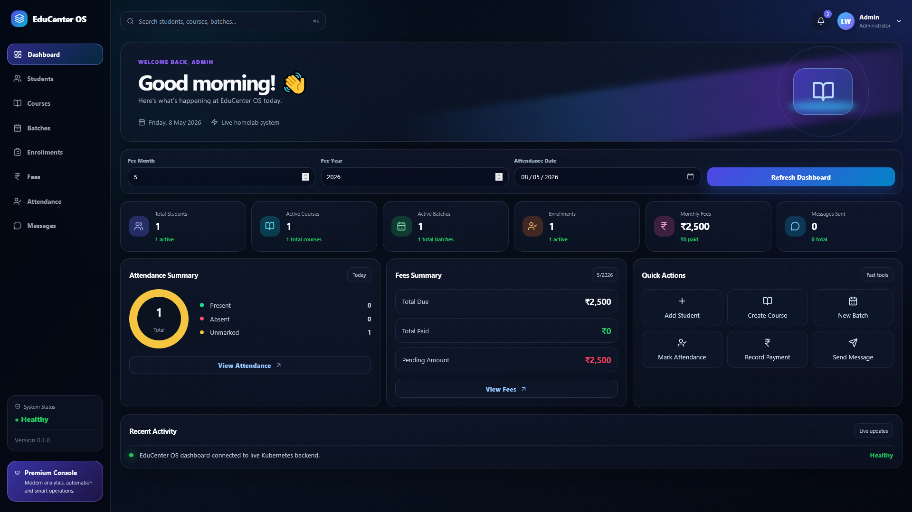

---

## 🚀 Project Overview

**EduCenter OS** is a premium education management platform built for coaching centers, tuition centers, training institutes, and small educational businesses.

It provides a complete system for managing:

- 👨‍🎓 Students
- 📚 Courses
- 🗓️ Batches
- 🧾 Enrollments
- 💸 Fees
- ✅ Attendance
- 💬 Messages
- 📊 Dashboard analytics
- ☸️ Kubernetes deployment
- 🔁 GitOps with Argo CD
- 📈 Monitoring with Prometheus
- 📊 Dashboards with Grafana
- 🏗️ Jenkins for CI/CD experimentation

This is not only a web app. It is a **complete DevOps homelab project** showing full-stack development, Docker, Kubernetes, GitOps, monitoring, and CI/CD infrastructure.

---

## ✨ Live Homelab URLs

> These URLs work inside the local network where the homelab server is running.

| Service | URL | Purpose |
|---|---|---|
| 🎓 EduCenter Frontend | `http://192.168.1.18:30080` | Main web app |
| ⚙️ EduCenter Backend | `http://192.168.1.18:30081` | FastAPI backend |
| 🔁 Argo CD | `https://192.168.1.18:30083` | GitOps dashboard |
| 📊 Grafana | `http://192.168.1.18:30084` | Monitoring dashboards |
| 📈 Prometheus | `http://192.168.1.18:30085` | Metrics and queries |
| 🏗️ Jenkins | `http://192.168.1.18:30086` | CI/CD server |

---

## 🧠 Why This Project Matters

This project demonstrates real-world DevOps and cloud-native engineering skills:

- ✅ Full-stack app development
- ✅ API-first backend design
- ✅ PostgreSQL database integration
- ✅ Docker image builds
- ✅ Docker Hub image publishing
- ✅ Kubernetes manifests
- ✅ NodePort service exposure
- ✅ Homelab server deployment
- ✅ GitHub source control
- ✅ Argo CD GitOps sync
- ✅ Prometheus metrics collection
- ✅ Grafana Kubernetes dashboards
- ✅ Jenkins installation on Kubernetes
- ✅ Production-style documentation

This project is useful for:

- DevOps portfolio
- Cloud Engineer portfolio
- Kubernetes practice
- Homelab demonstration
- GitOps learning
- Monitoring learning
- Full-stack SaaS prototype

---

## 🧱 Tech Stack

### 🎨 Frontend

- Next.js
- React
- TypeScript
- Custom premium CSS
- Lucide React icons
- Dockerized Node.js frontend

### ⚙️ Backend

- FastAPI
- Python
- SQLAlchemy
- Pydantic schemas
- PostgreSQL database

### ☸️ Infrastructure / DevOps

- Docker
- Docker Hub
- Kubernetes / K3s
- Helm
- Argo CD
- Prometheus
- Grafana
- Jenkins
- GitHub
- Ubuntu homelab server

---

## 🏗️ High-Level Architecture

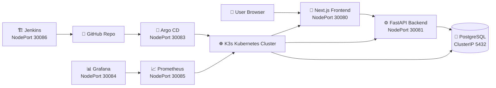

---

## ☸️ Kubernetes Namespace Layout

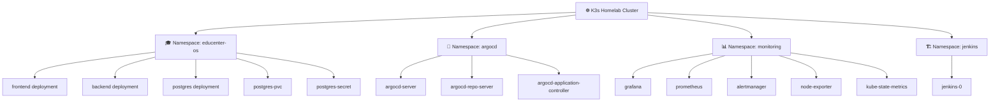

---

## 🔁 GitOps Flow with Argo CD

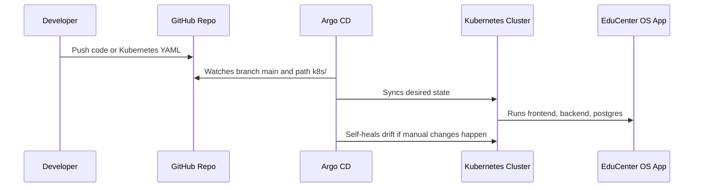

Argo CD application source:

```yaml
source:
  repoURL: https://github.com/lakshaywalia666/educenter-os.git
  targetRevision: main
  path: k8s
destination:
  namespace: educenter-os
syncPolicy:
  automated:
    prune: true
    selfHeal: true
```

---

## 📦 Repository Structure

```text
educenter-os/
├── backend/
│   ├── app/
│   │   ├── main.py
│   │   ├── database.py
│   │   ├── models.py
│   │   ├── schemas.py
│   │   └── routers/
│   │       ├── students.py
│   │       ├── courses.py
│   │       ├── batches.py
│   │       ├── enrollments.py
│   │       ├── fees.py
│   │       ├── attendance.py
│   │       ├── messages.py
│   │       └── dashboard.py
│   └── Dockerfile
│
├── frontend/
│   ├── app/
│   │   ├── components/
│   │   │   └── PremiumShell.tsx
│   │   ├── page.tsx
│   │   ├── students/page.tsx
│   │   ├── courses/page.tsx
│   │   ├── batches/page.tsx
│   │   ├── enrollments/page.tsx
│   │   ├── fees/page.tsx
│   │   ├── attendance/page.tsx
│   │   ├── messages/page.tsx
│   │   └── globals.css
│   └── Dockerfile
│
├── k8s/
│   ├── namespace.yaml
│   ├── backend-deployment.yaml
│   ├── backend-service.yaml
│   ├── frontend-deployment.yaml
│   ├── frontend-service.yaml
│   ├── postgres-deployment.yaml
│   ├── postgres-service.yaml
│   ├── postgres-secret.yaml
│   └── postgres-pvc.yaml
│
├── argocd/
│   └── educenter-os-app.yaml
│
├── docs/
│   └── screenshots/
│
├── scripts/
│   ├── install-k3s.sh
│   ├── deploy-educenter.sh
│   └── bootstrap-full-homelab.sh
│
├── docker-compose.yml
├── docker-compose.prod.yml
└── README.md
```

---

# 🖼️ Screenshots

## 🎛️ Premium Dashboard


## 👨‍🎓 Students Management

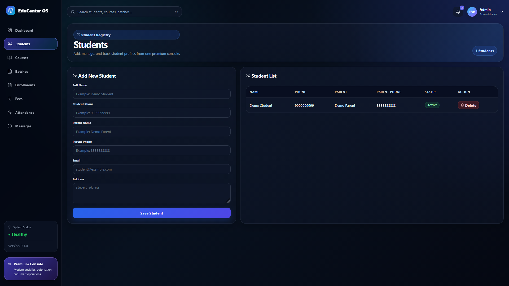

## 📚 Courses Management

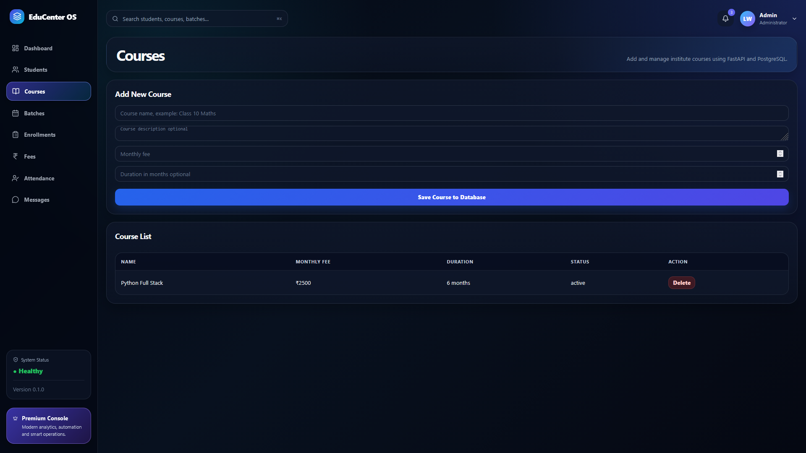

## 🗓️ Batches Management

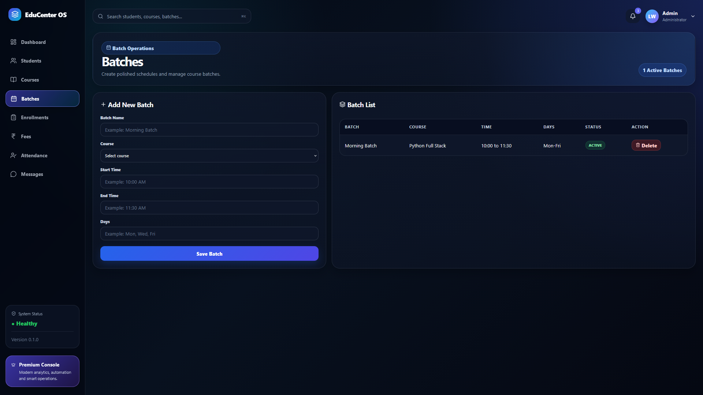

## 🧾 Enrollments Management

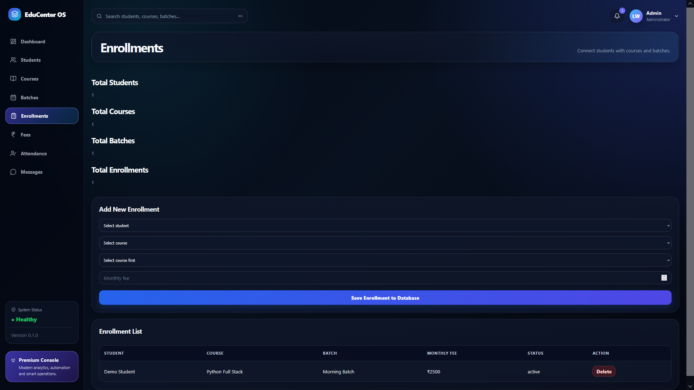

## 💸 Fees Management

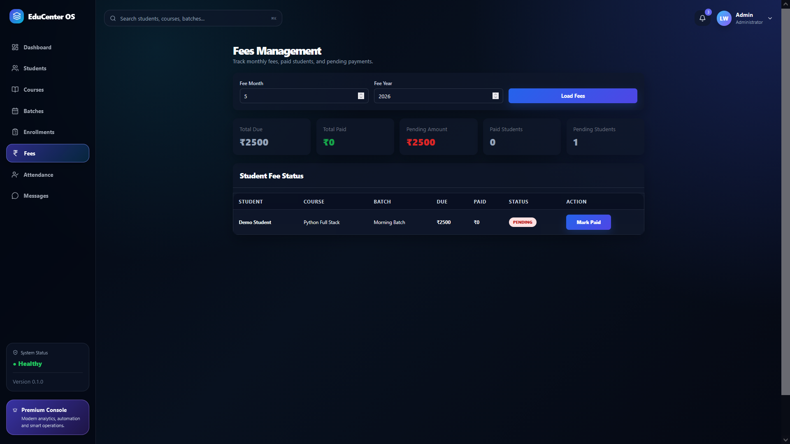

## ✅ Attendance Management

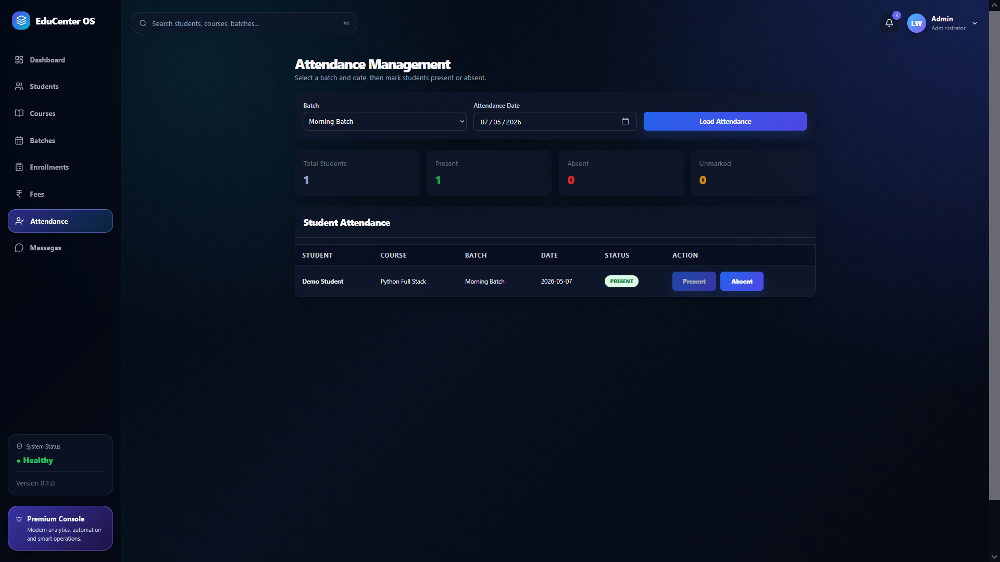

## 💬 Messages Module

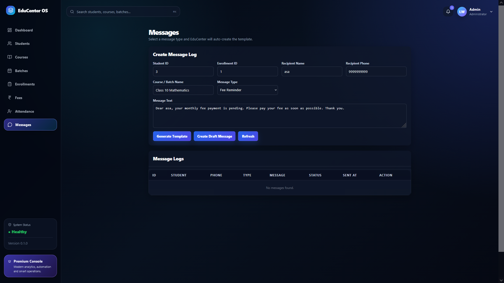

---

# 🔁 Argo CD GitOps

EduCenter OS is connected to Argo CD and synced from GitHub.

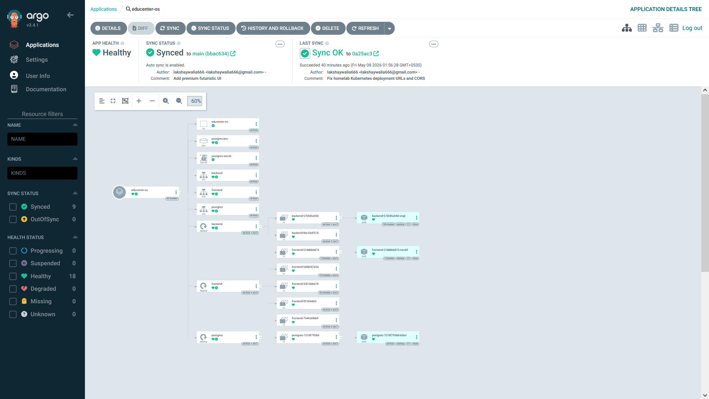

Argo CD watches:

```text
Repository: https://github.com/lakshaywalia666/educenter-os.git
Branch: main
Path: k8s/
Namespace: educenter-os
```

Current behavior:

- Argo CD watches GitHub
- Any Kubernetes manifest change in `k8s/` gets synced
- Auto-sync is enabled
- Self-heal is enabled
- Drift is automatically corrected

---

# 📊 Monitoring with Grafana and Prometheus

Grafana is installed through `kube-prometheus-stack` and connected to Prometheus.

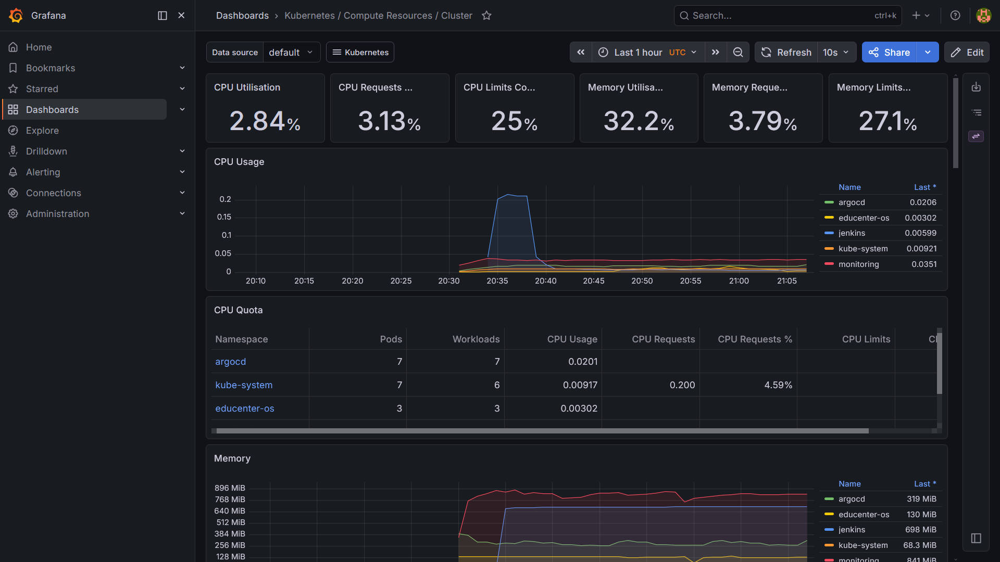

## Prometheus

Prometheus collects metrics from:

- Kubernetes nodes
- Pods
- Services
- kube-state-metrics
- node-exporter
- Kubernetes components

Prometheus URL:

```text
http://192.168.1.18:30085
```

Useful Prometheus query:

```promql
up
```

Targets page:

```text
Status → Targets
```

## Grafana

Grafana visualizes Prometheus metrics.

Grafana URL:

```text
http://192.168.1.18:30084
```

Recommended dashboards:

- Kubernetes / Compute Resources / Cluster
- Kubernetes / Compute Resources / Namespace
- Kubernetes / Compute Resources / Pod
- Node Exporter / Nodes
- Prometheus Overview

---

# 🚀 Fresh Server Setup

This repository includes a full bootstrap script for a fresh Ubuntu homelab server.

## ✅ What the Script Installs

The script installs and configures:

- Docker
- K3s Kubernetes
- kubectl config
- Helm
- EduCenter OS app
- Argo CD
- Prometheus
- Grafana
- Jenkins

## 🖥️ Fresh Server Requirements

| Resource | Minimum |
|---|---|
| OS | Ubuntu 22.04 / 24.04 |
| CPU | 2 cores+ |
| RAM | 8 GB minimum, 16 GB recommended |
| Disk | 50 GB+ |
| Network | Static LAN IP recommended |

Current tested homelab:

```text
Server IP: 192.168.1.18
User: lw
OS: Ubuntu 24.04
Kubernetes: K3s
```

---

## ⚡ One-Command Full Homelab Setup

On a fresh Ubuntu server:

```bash
sudo apt update
sudo apt install -y git

git clone https://github.com/lakshaywalia666/educenter-os.git
cd educenter-os

chmod +x scripts/bootstrap-full-homelab.sh

SERVER_IP=192.168.1.18 ./scripts/bootstrap-full-homelab.sh
```

If your server IP is different:

```bash
SERVER_IP=192.168.1.50 ./scripts/bootstrap-full-homelab.sh
```

---

# 🧪 Verify Deployment

Check all pods:

```bash
kubectl get pods -A
```

Expected important namespaces:

```text
educenter-os   backend/frontend/postgres running
argocd         all Argo CD pods running
monitoring     Grafana/Prometheus/Alertmanager running
jenkins        jenkins-0 running 2/2
kube-system    K3s system pods running
```

Check EduCenter OS services:

```bash
kubectl get svc -n educenter-os
```

Expected NodePorts:

```text
frontend   NodePort   3000:30080/TCP
backend    NodePort   8000:30081/TCP
postgres   ClusterIP  5432/TCP
```

Check Argo CD:

```bash
kubectl get application educenter-os -n argocd
```

Expected:

```text
SYNC STATUS: Synced
HEALTH STATUS: Healthy
```

---

# 🔑 Password Commands

## Argo CD Password

```bash
kubectl -n argocd get secret argocd-initial-admin-secret \
  -o jsonpath="{.data.password}" | base64 -d && echo
```

Login:

```text
Username: admin
URL: https://192.168.1.18:30083
```

## Grafana Password

```bash
kubectl get secret -n monitoring monitoring-grafana \
  -o jsonpath="{.data.admin-password}" | base64 -d && echo
```

Login:

```text
Username: admin
URL: http://192.168.1.18:30084
```

## Jenkins Password

```bash
kubectl exec -n jenkins -it jenkins-0 -c jenkins -- \
  cat /run/secrets/additional/chart-admin-password && echo
```

Login:

```text
Username: admin
URL: http://192.168.1.18:30086
```

---

# 🔌 Application API Flow

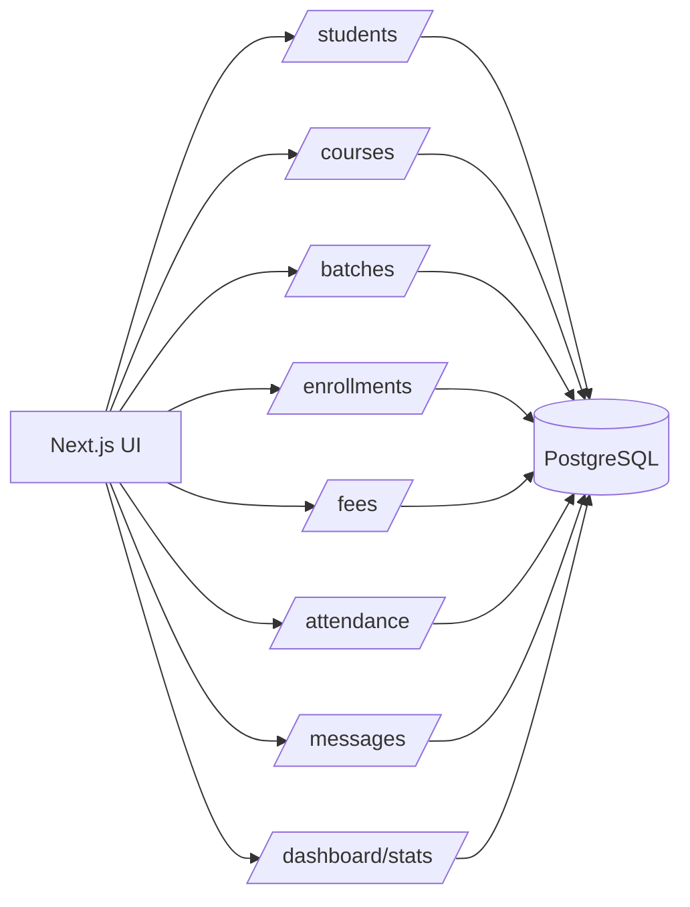

---

# 🧩 Main Modules

## 👨‍🎓 Students

Used to manage student profiles.

Fields include:

- Full name
- Phone
- Parent name
- Parent phone
- Email
- Address
- Status

## 📚 Courses

Used to manage course information.

Fields include:

- Course name
- Description
- Monthly fee
- Duration
- Status

## 🗓️ Batches

Used to group students into scheduled batches.

Fields include:

- Batch name
- Course
- Start time
- End time
- Days
- Status

## 🧾 Enrollments

Connects:

```text
Student + Course + Batch
```

Enrollments are important because they connect students to courses and batches. Attendance and fee tracking depend on this connection.

## ✅ Attendance

Attendance depends on active enrollments.

Flow:

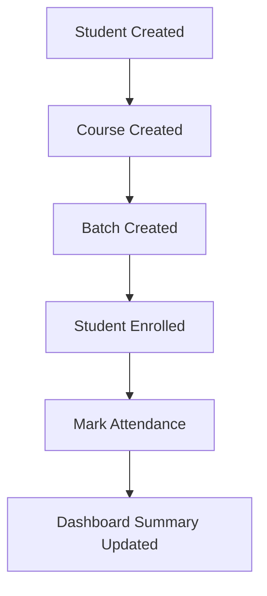

## 💸 Fees

Tracks monthly fee information.

Includes:

- Total due
- Total paid
- Pending amount
- Payment status

## 💬 Messages

Logs student or parent communication.

Can be used for:

- Attendance reminders
- Fee reminders
- Course updates
- General communication history

---

# 🐳 Docker Images

Frontend image:

```text
docker.io/lakshaywalia666/educenter-os-frontend:latest
```

Backend image:

```text
docker.io/lakshaywalia666/educenter-os-backend:latest
```

Database image:

```text
postgres:16
```

---

# ☸️ Kubernetes Manifests

Kubernetes manifests are stored in:

```text
k8s/
```

| File | Purpose |
|---|---|
| `namespace.yaml` | Creates `educenter-os` namespace |
| `postgres-secret.yaml` | Database credentials |
| `postgres-pvc.yaml` | Persistent database storage |
| `postgres-deployment.yaml` | PostgreSQL pod |
| `postgres-service.yaml` | Internal database service |
| `backend-deployment.yaml` | FastAPI backend deployment |
| `backend-service.yaml` | Backend NodePort 30081 |
| `frontend-deployment.yaml` | Next.js frontend deployment |
| `frontend-service.yaml` | Frontend NodePort 30080 |

---

# 📈 Monitoring Installation

Monitoring stack is installed with Helm:

```bash
helm upgrade --install monitoring prometheus-community/kube-prometheus-stack \
  --namespace monitoring \
  --create-namespace \
  --set grafana.service.type=NodePort \
  --set grafana.service.nodePort=30084 \
  --set prometheus.service.type=NodePort \
  --set prometheus.service.nodePort=30085 \
  --set kubeControllerManager.enabled=false \
  --set kubeScheduler.enabled=false \
  --set kubeEtcd.enabled=false
```

Check monitoring pods:

```bash
kubectl get pods -n monitoring
```

Expected:

```text
monitoring-grafana                         Running
prometheus-monitoring-kube-prometheus      Running
alertmanager-monitoring-kube-prometheus    Running
monitoring-kube-state-metrics              Running
monitoring-prometheus-node-exporter        Running
monitoring-kube-prometheus-operator        Running
```

---

# 🏗️ Jenkins

Jenkins is installed with Helm:

```bash
helm upgrade --install jenkins jenkins/jenkins \
  --namespace jenkins \
  --create-namespace \
  --set controller.serviceType=NodePort \
  --set controller.nodePort=30086 \
  --set persistence.storageClass=local-path \
  --set persistence.size=8Gi
```

Jenkins URL:

```text
http://192.168.1.18:30086
```

Jenkins can later be used to automate:

- Docker image builds
- Docker Hub pushes
- GitHub webhooks
- Kubernetes deployment pipelines

---

# 🔄 Development Workflow

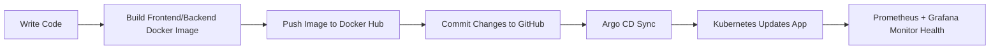

---

# 🧰 Common Commands

## Check app pods

```bash
kubectl get pods -n educenter-os
```

## Check all cluster pods

```bash
kubectl get pods -A
```

## Restart frontend

```bash
kubectl rollout restart deployment/frontend -n educenter-os
```

## Restart backend

```bash
kubectl rollout restart deployment/backend -n educenter-os
```

## Check services

```bash
kubectl get svc -A
```

## Check Argo CD app

```bash
kubectl get application educenter-os -n argocd
```

## Check monitoring pods

```bash
kubectl get pods -n monitoring
```

## Check Jenkins

```bash
kubectl get pods -n jenkins
kubectl get svc -n jenkins
```

---

# 🛠️ Troubleshooting

## Frontend cannot connect to backend

Check backend service:

```bash
kubectl get svc -n educenter-os
```

Backend should expose:

```text
8000:30081/TCP
```

Check backend health:

```bash
curl -i http://192.168.1.18:30081/health
```

## Browser CORS error

Backend must allow frontend origin:

```text
http://192.168.1.18:30080
```

Check backend CORS:

```bash
grep -n "allow_origins" -A8 backend/app/main.py
```

## Pods not running

```bash
kubectl describe pod <pod-name> -n <namespace>
kubectl logs <pod-name> -n <namespace>
```

## Argo CD out of sync

```bash
kubectl get application educenter-os -n argocd
kubectl describe application educenter-os -n argocd
```

## Grafana not opening

```bash
kubectl get svc -n monitoring
kubectl get pods -n monitoring
```

Grafana should expose:

```text
80:30084/TCP
```

## Jenkins not opening

```bash
kubectl get pods -n jenkins
kubectl get svc -n jenkins
```

Jenkins should expose:

```text
8080:30086/TCP
```

---

# ✅ Final Homelab Status

Current tested status:

```text
EduCenter OS Frontend ✅
EduCenter OS Backend ✅
PostgreSQL Database ✅
Argo CD GitOps ✅
Grafana Dashboard ✅
Prometheus Metrics ✅
Jenkins Running ✅
K3s Kubernetes ✅
GitHub Updated ✅
Docker Images Pushed ✅
Premium UI Live ✅
```

---

# 👨‍💻 Author

Built by **Lakshay Walia**

GitHub:

```text
https://github.com/lakshaywalia666
```

Docker Hub:

```text
docker.io/lakshaywalia666
```

---

# ⭐ Portfolio Highlight

This project demonstrates:

- Full-stack product building
- Real Kubernetes deployment
- Homelab infrastructure
- GitOps automation
- Monitoring and observability
- CI/CD tooling
- Premium UI design
- DevOps troubleshooting
- Production-style documentation

> EduCenter OS is a complete end-to-end DevOps + full-stack homelab project.
	
