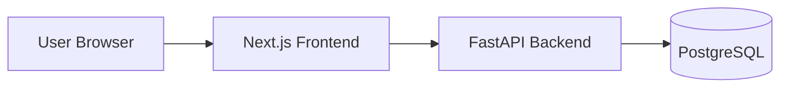
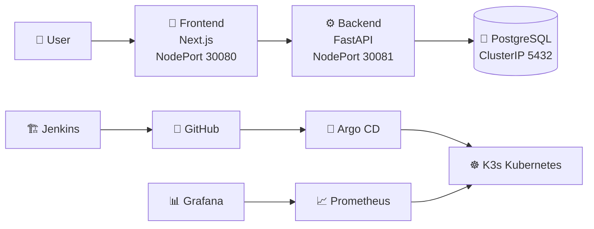
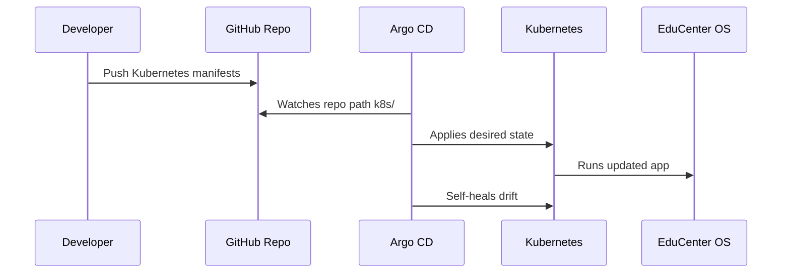
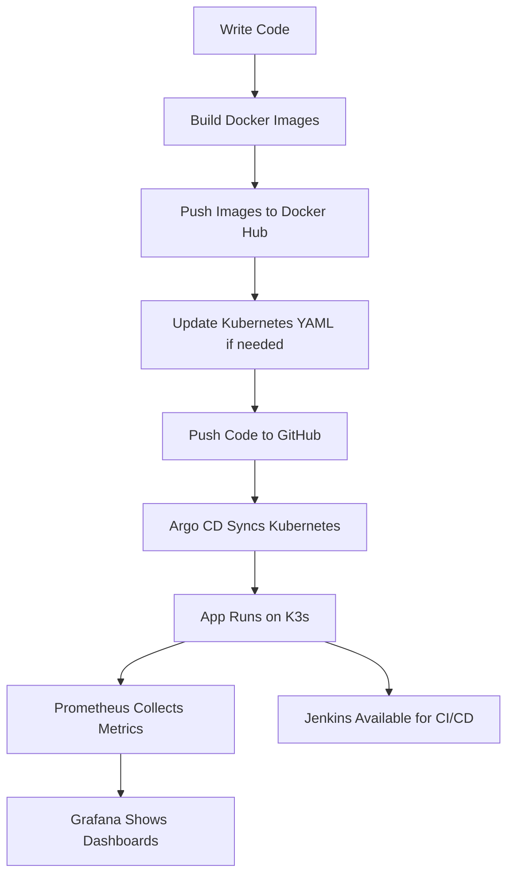
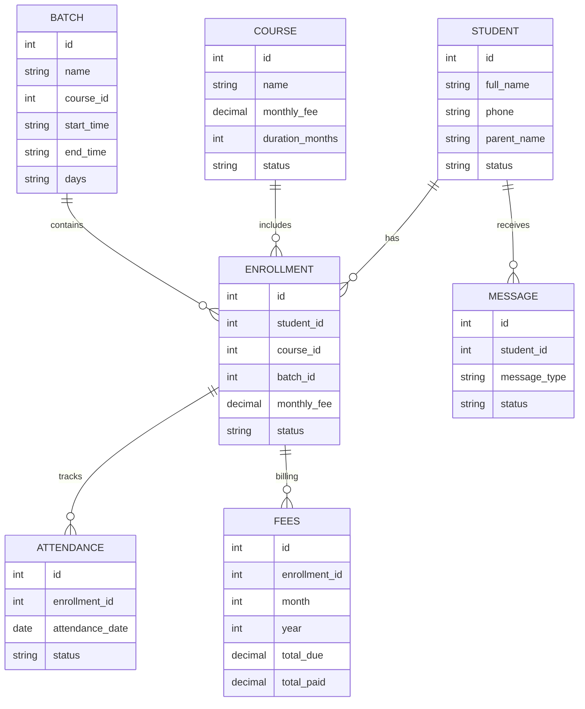

# 🎓 EduCenter OS — Deep Study & Project Explanation Document  
## From Zero to Ultra-Detailed Master Understanding

**Project:** EduCenter OS  
**Author:** Lakshay Walia  
**Repository:** https://github.com/lakshaywalia666/educenter-os  
**Main App URL in Homelab:** `http://192.168.1.18:30080`  
**Backend API URL in Homelab:** `http://192.168.1.18:30081`

---

# 1. What Is EduCenter OS?

**EduCenter OS** is a full-stack, cloud-native education management platform designed for coaching centers, tuition centers, training institutes, and small educational organizations.

It helps an institute manage the daily operational workflow of:

- Students  
- Courses  
- Batches  
- Enrollments  
- Fees  
- Attendance  
- Messages  
- Dashboard analytics  

But this project is bigger than only a web application.

It is also a complete **DevOps homelab project** because the app is:

- containerized with Docker,
- deployed on Kubernetes/K3s,
- connected with Argo CD for GitOps,
- monitored with Prometheus and Grafana,
- supported by Jenkins for CI/CD experimentation,
- documented with screenshots and a full bootstrap setup script.

So EduCenter OS is both:

1. **A real education SaaS-style application**, and  
2. **A practical DevOps/cloud-native portfolio project**.

---

# 2. Why We Made This Project

The goal was to build something real, useful, and technically strong.

Many small coaching centers and institutes manage everything manually using:

- notebooks,
- WhatsApp chats,
- Excel sheets,
- random payment notes,
- phone call records,
- paper attendance registers.

This creates problems:

- Student data is scattered.
- Attendance records are difficult to track.
- Fee collection is not centralized.
- Batch information is hard to manage.
- There is no single dashboard.
- Parent communication has no proper history.
- Business owners cannot quickly see what is happening.

EduCenter OS solves this by giving a centralized system where all core academic and business operations can be managed from one place.

From a learning perspective, this project was made to practice and demonstrate:

- full-stack application development,
- backend API design,
- frontend UI design,
- database modeling,
- Docker containerization,
- Kubernetes deployment,
- GitOps automation,
- monitoring and observability,
- CI/CD tooling,
- homelab infrastructure.

---

# 3. Real-World Problem Statement

Small and medium education centers often do not have a proper operating system for their business.

A coaching center needs to answer questions like:

- How many students are active?
- Which courses are running?
- Which students are in which batch?
- Who paid fees this month?
- Who is pending payment?
- Who was absent today?
- Which messages were sent to parents?
- How is the institute performing?

Without software, this becomes messy.

EduCenter OS acts like a mini ERP/CRM for education centers.

It brings all the important information into one connected platform.

---

# 4. Project Vision

The long-term vision of EduCenter OS is to become a complete operating system for coaching centers and education businesses.

A mature version could include:

- online admission forms,
- WhatsApp reminders,
- fee invoices,
- parent portal,
- student portal,
- teacher login,
- attendance reports,
- revenue analytics,
- payment gateway,
- certificate generation,
- exam/test management,
- AI-based insights,
- multi-branch support.

The current version is the foundation.

It already includes the core modules needed to build a larger system.

---

# 5. Main Features

## 5.1 Dashboard

The dashboard gives a live overview of the system.

It shows:

- total students,
- active courses,
- active batches,
- enrollments,
- monthly fees,
- messages sent,
- attendance summary,
- fee summary,
- quick actions.

The dashboard is important because it gives the owner/admin a fast view of the institute.

Instead of opening every page separately, the dashboard summarizes key business data.

---

## 5.2 Students Module

The Students module manages student profiles.

It stores information like:

- full name,
- phone number,
- parent name,
- parent phone,
- email,
- address,
- status.

Why this matters:

Student data is the foundation of the system.  
Every other module depends on students.

A student can later be connected to:

- courses,
- batches,
- enrollments,
- attendance,
- fees,
- messages.

---

## 5.3 Courses Module

The Courses module manages the courses offered by the institute.

A course can have:

- course name,
- description,
- monthly fee,
- duration in months,
- status.

Examples:

- Python Full Stack
- Web Development
- Spoken English
- Data Analytics
- Class 10 Mathematics
- Cloud Computing Basics

Why this matters:

Courses define what the institute sells or teaches.

Fees and batches are linked to courses.

---

## 5.4 Batches Module

The Batches module manages scheduled groups of students.

A batch can have:

- batch name,
- course ID,
- start time,
- end time,
- days,
- status.

Example:

- Morning Batch
- Evening Batch
- Weekend Batch
- Python Full Stack — 10 AM Batch

Why this matters:

A course may have multiple batches.

For example, “Python Full Stack” can have:

- Morning Batch
- Evening Batch
- Weekend Batch

Attendance is usually marked batch-wise.

---

## 5.5 Enrollments Module

The Enrollments module connects:

```text
Student + Course + Batch
```

This is one of the most important relationships in the system.

Example:

```text
Demo Student
enrolled in
Python Full Stack
inside
Morning Batch
```

Why enrollments matter:

Attendance depends on enrollments.  
Fees depend on enrollments.  
Dashboard analytics depend on enrollments.

Without enrollment, a student exists in the database but is not connected to learning activity.

---

## 5.6 Attendance Module

The Attendance module tracks who is present, absent, or unmarked.

It depends on:

- batch,
- enrollment,
- attendance date.

The attendance flow is:

```text
Create Student
Create Course
Create Batch
Enroll Student
Mark Attendance
Dashboard Updates
```

Attendance statuses can include:

- present,
- absent,
- unmarked.

Why this matters:

Attendance is one of the most common daily operations in a coaching center.

It can later be used for:

- low attendance alerts,
- WhatsApp reminders,
- monthly reports,
- parent notifications,
- student performance analysis.

---

## 5.7 Fees Module

The Fees module tracks fee payment information.

It includes:

- monthly fee,
- paid amount,
- pending amount,
- payment month,
- payment year,
- payment status.

Why this matters:

Fee tracking is one of the most important business operations.

The owner needs to know:

- how much money is due,
- how much has been paid,
- who has pending fees,
- what revenue came this month.

This module can later be extended with:

- Razorpay integration,
- payment receipts,
- PDF invoices,
- WhatsApp reminders,
- automatic due alerts.

---

## 5.8 Messages Module

The Messages module records communication logs.

It can be used for:

- attendance alerts,
- fee reminders,
- course updates,
- general parent messages.

Current version stores message logs.

Future version can integrate:

- WhatsApp Business API,
- SMS gateway,
- email notifications,
- automated reminders.

---

# 6. Technology Stack Explained

## 6.1 Frontend — Next.js and React

The frontend is built using Next.js and React.

Why Next.js?

- It is modern.
- It supports page-based routing.
- It works well with React components.
- It is suitable for SaaS dashboards.
- It can be containerized easily.

Why React?

- Component-based UI.
- Easy state management with hooks.
- Reusable components.
- Good ecosystem.

The frontend has pages like:

```text
/
students/
courses/
batches/
enrollments/
fees/
attendance/
messages/
```

The UI was upgraded to a premium futuristic SaaS design using:

- custom CSS,
- dark theme,
- glass-like cards,
- clean sidebar,
- premium dashboard,
- Lucide icons.

---

## 6.2 Backend — FastAPI

The backend is built using FastAPI.

Why FastAPI?

- Very fast Python framework.
- Automatic API docs with Swagger.
- Strong Pydantic validation.
- Clean router structure.
- Easy integration with SQLAlchemy.
- Suitable for production APIs.

Backend URL:

```text
http://192.168.1.18:30081
```

FastAPI docs are available at:

```text
http://192.168.1.18:30081/docs
```

Backend contains routers for:

```text
students
courses
batches
enrollments
fees
attendance
messages
dashboard
```

Each router handles API operations for its module.

---

## 6.3 Database — PostgreSQL

PostgreSQL is used as the database.

Why PostgreSQL?

- Reliable relational database.
- Good for structured business data.
- Supports relationships between tables.
- Production-ready.
- Common in real-world SaaS systems.

Database stores:

- students,
- courses,
- batches,
- enrollments,
- attendance,
- fees,
- messages.

In Kubernetes, PostgreSQL runs as a pod with persistent volume storage.

This means the database can keep data even if the pod restarts.

---

## 6.4 ORM — SQLAlchemy

SQLAlchemy connects Python backend code to the database.

It allows the app to define models in Python instead of writing raw SQL everywhere.

Example concept:

```text
Student model → students table
Course model → courses table
Batch model → batches table
```

SQLAlchemy helps with:

- table definitions,
- relationships,
- queries,
- inserts,
- updates,
- deletes.

---

## 6.5 Schemas — Pydantic

Pydantic schemas define what data is expected in API requests and responses.

Example:

A student creation request needs:

```text
full_name
phone
parent_name
email
status
```

Pydantic validates the data before it reaches business logic.

This improves API safety and structure.

---

# 7. Application Architecture

## 7.1 Basic User Flow



The browser opens the frontend.

The frontend calls the backend APIs.

The backend reads/writes data from PostgreSQL.

The database stores the system records.

---

## 7.2 Full Homelab Architecture



---

# 8. Kubernetes Deployment

EduCenter OS is deployed on K3s Kubernetes.

K3s is a lightweight Kubernetes distribution.

Why K3s?

- Lightweight.
- Good for homelabs.
- Works well on laptops and small servers.
- Easy to install.
- Production-like Kubernetes experience.

The server used:

```text
Ubuntu 24.04
K3s Kubernetes
Static LAN IP: 192.168.1.18
Username: lw
```

---

## 8.1 Kubernetes Namespace

The app runs in namespace:

```text
educenter-os
```

Namespaces help separate resources.

EduCenter OS has:

- frontend deployment,
- backend deployment,
- postgres deployment,
- frontend service,
- backend service,
- postgres service,
- postgres secret,
- postgres PVC.

---

## 8.2 Kubernetes Services

The frontend and backend are exposed using NodePort.

```text
Frontend NodePort: 30080
Backend NodePort: 30081
```

This allows other devices on the LAN to access the app.

URLs:

```text
Frontend: http://192.168.1.18:30080
Backend:  http://192.168.1.18:30081
```

PostgreSQL is ClusterIP only.

That means it is accessible inside the Kubernetes cluster but not publicly from the LAN.

This is safer because users do not need to directly access the database.

---

## 8.3 Why Backend Was Changed to NodePort

At first, the backend was only ClusterIP.

That caused the frontend browser to fail because the browser runs on the user’s machine and cannot access Kubernetes internal ClusterIP.

Fix:

```text
backend service changed from ClusterIP to NodePort 30081
```

Now browser can call:

```text
http://192.168.1.18:30081
```

---

## 8.4 CORS Fix

The backend originally allowed only:

```text
http://localhost:3000
http://127.0.0.1:3000
```

But the deployed frontend runs at:

```text
http://192.168.1.18:30080
```

So backend CORS had to allow this origin.

Fix:

```text
http://192.168.1.18:30080
```

was added to backend CORS allow_origins.

---

# 9. Docker Images

Frontend image:

```text
docker.io/lakshaywalia666/educenter-os-frontend:latest
```

Backend image:

```text
docker.io/lakshaywalia666/educenter-os-backend:latest
```

Database image:

```text
postgres:16
```

Why Docker?

Docker packages the application with everything needed to run it.

This prevents environment mismatch.

For example:

- frontend runs inside Node container,
- backend runs inside Python container,
- database runs inside PostgreSQL container.

---

# 10. GitHub Repository

Repository:

```text
https://github.com/lakshaywalia666/educenter-os.git
```

GitHub stores:

- source code,
- Kubernetes manifests,
- Argo CD app manifest,
- screenshots,
- README,
- bootstrap script,
- Docker-related files.

Important commits included:

```text
Fix homelab Kubernetes deployment URLs and CORS
Add Argo CD application manifest
Add premium futuristic UI
Add premium README screenshots and full homelab bootstrap script
```

Latest known pushed commit:

```text
4d1d372 Add premium README screenshots and full homelab bootstrap script
```

---

# 11. Argo CD GitOps

Argo CD is used for GitOps.

URL:

```text
https://192.168.1.18:30083
```

Argo CD watches:

```text
Repo: https://github.com/lakshaywalia666/educenter-os.git
Branch: main
Path: k8s
Namespace: educenter-os
```

Meaning:

If Kubernetes YAML changes are pushed to GitHub, Argo CD detects those changes and syncs them to Kubernetes.

---

## 11.1 GitOps Concept

GitOps means Git is the source of truth.

Instead of manually changing Kubernetes objects, we store desired state in Git.

Argo CD compares:

```text
GitHub desired state
vs
Kubernetes actual state
```

If they differ, Argo CD can sync them.

---

## 11.2 Argo CD Flow



---

# 12. Monitoring with Prometheus and Grafana

Monitoring stack is installed using kube-prometheus-stack.

Grafana URL:

```text
http://192.168.1.18:30084
```

Prometheus URL:

```text
http://192.168.1.18:30085
```

Prometheus collects metrics.

Grafana visualizes those metrics.

---

## 12.1 Prometheus

Prometheus collects metrics from:

- Kubernetes nodes,
- pods,
- services,
- containers,
- node exporter,
- kube-state-metrics,
- Prometheus operator.

Useful query:

```promql
up
```

This shows whether targets are up or down.

Prometheus can help answer:

- Are pods running?
- Are services reachable?
- Are nodes healthy?
- Is memory usage high?
- Is CPU usage high?

---

## 12.2 Grafana

Grafana shows dashboards.

Recommended dashboards:

- Kubernetes / Compute Resources / Cluster
- Kubernetes / Compute Resources / Namespace
- Kubernetes / Compute Resources / Pod
- Node Exporter / Nodes
- Prometheus Overview

Grafana is useful because raw metrics are hard to read.

Grafana turns metrics into:

- charts,
- graphs,
- tables,
- panels,
- dashboards.

---

# 13. Jenkins

Jenkins is installed in Kubernetes.

URL:

```text
http://192.168.1.18:30086
```

Jenkins can later be used to automate:

- building frontend Docker image,
- building backend Docker image,
- pushing images to Docker Hub,
- triggering Kubernetes rollout,
- running tests,
- connecting GitHub webhooks.

Current Jenkins status:

```text
jenkins-0 running 2/2
```

---

# 14. Fresh Server Rebuild Plan

One of the strongest parts of this project is that it can be rebuilt from GitHub on a fresh Ubuntu server.

Commands:

```bash
sudo apt update
sudo apt install -y git

cd ~
git clone https://github.com/lakshaywalia666/educenter-os.git
cd educenter-os

chmod +x scripts/bootstrap-full-homelab.sh
SERVER_IP=192.168.1.18 ./scripts/bootstrap-full-homelab.sh
```

The script installs:

- Docker,
- K3s,
- Helm,
- EduCenter OS,
- Argo CD,
- Prometheus,
- Grafana,
- Jenkins.

This makes the project reproducible.

That is very important in DevOps.

A good DevOps project is not only something that works once.  
It should be rebuildable.

---

# 15. Full Project Workflow



---

# 16. How Frontend and Backend Communicate

Frontend runs at:

```text
http://192.168.1.18:30080
```

Backend runs at:

```text
http://192.168.1.18:30081
```

Frontend calls backend APIs like:

```text
/students/
/courses/
/batches/
/enrollments/
/fees/
/attendance/
/messages/
/dashboard/stats
```

Example dashboard API:

```text
http://192.168.1.18:30081/dashboard/stats
```

The backend returns JSON.

The frontend displays that JSON as UI cards, tables, and summaries.

---

# 17. Database Relationship Explanation

Core relationship:

```text
Student
Course
Batch
Enrollment
Attendance
Fees
Messages
```

A student can be enrolled into a course and batch.

Attendance is marked for enrolled students.

Fees are tracked for enrolled students.

Messages can be sent or logged for students/parents.

---

## 17.1 Relationship Diagram



---

# 18. What We Fixed During Deployment

Several real-world issues were solved.

## 18.1 Backend Service Access Issue

Problem:

Backend was ClusterIP only.

Frontend browser could not access backend.

Fix:

Backend service changed to NodePort.

```text
Backend exposed on 30081
```

---

## 18.2 Frontend API URL Issue

Problem:

Frontend was calling:

```text
http://localhost:8000
```

In browser, localhost means the user’s computer, not the Kubernetes server.

Fix:

Frontend now calls:

```text
http://192.168.1.18:30081
```

---

## 18.3 CORS Issue

Problem:

Browser blocked frontend-to-backend requests.

Fix:

Backend allowed:

```text
http://192.168.1.18:30080
```

in CORS settings.

---

## 18.4 Attendance Page Issue

Problem:

Attendance page showed error because there was no batch/enrollment data.

Backend returned:

```text
Batch not found
```

Fix:

Created test data in correct order:

```text
Course → Batch → Student → Enrollment → Attendance
```

After this, attendance worked properly.

---

# 19. Final Working URLs

```text
EduCenter Frontend: http://192.168.1.18:30080
EduCenter Backend:  http://192.168.1.18:30081
Argo CD:            https://192.168.1.18:30083
Grafana:            http://192.168.1.18:30084
Prometheus:         http://192.168.1.18:30085
Jenkins:            http://192.168.1.18:30086
```

---

# 20. Important Commands

## 20.1 Check All Pods

```bash
kubectl get pods -A
```

## 20.2 Check EduCenter Pods

```bash
kubectl get pods -n educenter-os
```

## 20.3 Check EduCenter Services

```bash
kubectl get svc -n educenter-os
```

## 20.4 Restart Frontend

```bash
kubectl rollout restart deployment/frontend -n educenter-os
```

## 20.5 Restart Backend

```bash
kubectl rollout restart deployment/backend -n educenter-os
```

## 20.6 Check Argo CD App

```bash
kubectl get application educenter-os -n argocd
```

## 20.7 Check Monitoring

```bash
kubectl get pods -n monitoring
```

## 20.8 Check Jenkins

```bash
kubectl get pods -n jenkins
kubectl get svc -n jenkins
```

---

# 21. Password Commands

## 21.1 Argo CD Password

```bash
kubectl -n argocd get secret argocd-initial-admin-secret \
  -o jsonpath="{.data.password}" | base64 -d && echo
```

## 21.2 Grafana Password

```bash
kubectl get secret -n monitoring monitoring-grafana \
  -o jsonpath="{.data.admin-password}" | base64 -d && echo
```

## 21.3 Jenkins Password

```bash
kubectl exec -n jenkins -it jenkins-0 -c jenkins -- \
  cat /run/secrets/additional/chart-admin-password && echo
```

---

# 22. What Makes This Project Good for Learning

This project teaches:

## Full-Stack Development

- How frontend talks to backend.
- How APIs are structured.
- How database records are connected.
- How UI displays live data.

## Backend Development

- FastAPI routers.
- Pydantic schemas.
- SQLAlchemy models.
- PostgreSQL connection.
- CORS handling.
- REST API design.

## Frontend Development

- Next.js pages.
- React state.
- Fetch API.
- Dashboard UI.
- Forms.
- Tables.
- Premium SaaS layout.

## Docker

- Building images.
- Pushing images.
- Running apps in containers.
- Separating frontend/backend/database.

## Kubernetes

- Deployments.
- Services.
- Namespaces.
- Secrets.
- PVCs.
- NodePorts.
- Rollouts.
- Logs.
- Pod health.

## GitOps

- Argo CD.
- Git as source of truth.
- Auto sync.
- Self heal.

## Monitoring

- Prometheus scraping.
- Grafana dashboards.
- Node exporter.
- kube-state-metrics.

## CI/CD

- Jenkins installation.
- CI/CD pipeline possibilities.
- Docker build automation.

---

# 23. How to Explain This Project in an Interview

A strong answer:

> EduCenter OS is a full-stack education management platform that I built and deployed on a real homelab Kubernetes cluster. The frontend is built with Next.js, the backend with FastAPI, and PostgreSQL is used as the database. I containerized the frontend and backend with Docker, pushed images to Docker Hub, and deployed everything on K3s using Kubernetes manifests. I also set up Argo CD for GitOps, Prometheus and Grafana for monitoring, and Jenkins for CI/CD experimentation. The project includes a premium UI, full README documentation, screenshots, and a bootstrap script that can recreate the environment on a fresh Ubuntu server.

---

# 24. Resume Bullet Points

You can use these in resume:

- Built and deployed **EduCenter OS**, a full-stack education management platform using **Next.js, FastAPI, PostgreSQL, Docker, and Kubernetes**.
- Deployed application on a **K3s homelab cluster** with frontend/backend NodePort services and persistent PostgreSQL storage.
- Implemented **GitOps workflow using Argo CD** to sync Kubernetes manifests from GitHub.
- Installed and configured **Prometheus and Grafana** for Kubernetes monitoring and cluster observability.
- Deployed **Jenkins on Kubernetes** for CI/CD pipeline experimentation.
- Created full project documentation with architecture diagrams, screenshots, and a fresh-server bootstrap script.

---

# 25. Future Improvements

The project can be improved with:

- Environment variables instead of hardcoded IPs.
- HTTPS with domain name.
- Ingress routing with Traefik.
- WhatsApp Business integration.
- Payment gateway integration.
- Jenkins pipeline for automatic Docker build/push.
- Automated database backups.
- Role-based login system.
- Teacher dashboard.
- Student dashboard.
- Parent portal.
- Multi-branch support.
- Analytics reports.
- Email/SMS alerts.
- Helm chart for EduCenter OS.
- Production-grade secrets management.

---

# 26. Current Final Status

```text
EduCenter OS app running ✅
Frontend working ✅
Backend working ✅
PostgreSQL working ✅
Attendance working ✅
Premium UI live ✅
Docker images pushed ✅
Kubernetes running ✅
Argo CD synced ✅
Grafana working ✅
Prometheus working ✅
Jenkins running ✅
GitHub updated ✅
README updated ✅
Screenshots added ✅
Bootstrap script added ✅
Windows repo restored from GitHub ✅
```

---

# 27. Summary

EduCenter OS is a complete practical project that combines:

- product thinking,
- education business workflow,
- full-stack development,
- DevOps,
- Kubernetes,
- monitoring,
- GitOps,
- CI/CD tooling,
- documentation.

It is useful both as a real software foundation and as a portfolio project.

The strongest part of this project is that it is not just code on GitHub.  
It is actually deployed and running on a real homelab server.

That makes it a strong demonstration of hands-on engineering skill.
